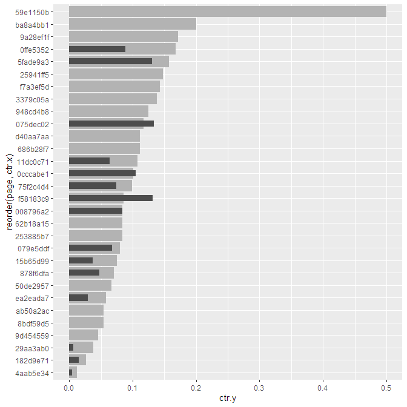
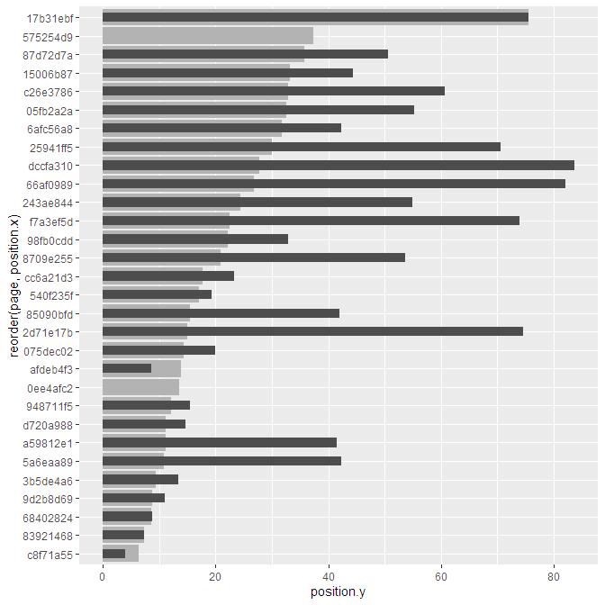

Search Console API - Search Analytics Data Consistency Test
================

  - [Introduction](#introduction)
  - [Summary](#summary)
  - [API call parameters](#api-call-parameters)
  - [Grand totals](#grand-totals)
      - [Aggreagated by property](#aggreagated-by-property)
      - [Aggregated by page](#aggregated-by-page)
      - [Difference due to the aggregation
        type](#difference-due-to-the-aggregation-type)
      - [Conclusion to aggregation
        types](#conclusion-to-aggregation-types)
  - [How aggregation depends on
    dimensions](#how-aggregation-depends-on-dimensions)
      - [impressions / clicks: 16264 /
        838](#impressions--clicks-16264--838)
      - [impressions / clicks: 14137 /
        830](#impressions--clicks-14137--830)
      - [impressions / clicks: 9311 /
        346](#impressions--clicks-9311--346)
      - [impressions / clicks: 7927 /
        346](#impressions--clicks-7927--346)
      - [Conclusion to dimension
        combinations](#conclusion-to-dimension-combinations)
  - [Poisonous *page* dimension](#poisonous-page-dimension)
      - [Conclusion to multiple dimensions with
        *page*](#conclusion-to-multiple-dimensions-with-page)

# Introduction

[Google Search Console
API](https://developers.google.com/webmaster-tools/search-console-api-original)
and especially it’s [Search
Analytics](https://developers.google.com/webmaster-tools/search-console-api-original/v3/searchanalytics)
is quite popular in marketing world. Some marketers and analysts use it
directly and even more of them use it through another tools, such as
[Google Data Studio](https://datastudio.google.com/), [Search Analytics
for Sheets](https://searchanalyticsforsheets.com/) etc.

People often expect the API provides consistent data that always sum up
to the same grand totals, regardless of chosen dimensions, but it is not
true. The API has some “special features”, which makes results rather
inconsistent, and only some of them are properly documented.

The purpose of this analysis is to examine behavior of Google Search
Console API and in particular *search\_analytics* function from [Mark
Edmondson’s searchConsoleR
package](https://code.markedmondson.me/searchConsoleR/). The reason is
to document the exact impact of dimension combinations on the resulting
data.

# Summary

When fetching Search Analytics data from Google Search Console API, you
can get **four different results** depending on a combination of
dimensions you provide in a request. For instance inclusion of the
*page* dimension turns on the [aggregation
type](https://support.google.com/webmasters/answer/7576553?visit_id=637515076005217085-649433118&rd=1#urlorsite&zippy=%2Cqueries)
*by page* instead of default *by property*. Also inclusion of the
*query* dimension affects the resulting data, because [some queries are
anonymized and
excluded](https://support.google.com/webmasters/answer/7576553?visit_id=637515076005217085-649433118&rd=1#urlorsite&zippy=%2Cqueries)
from the results.

However, the *page* dimension not only turns on the aggregation *by
page*, but also unpredictably affects the results when combined with any
other dimension but *date*. Either a bug, or feature, this is not
documented in the API.

# API call parameters

    ## Search Console API will be called with the following parameters:
    ## 
    ## Property: http://www.cajtydne.cz/
    ## Period: 2021-02-14 to 2021-03-13 (28 days)
    ## Search Type: web

# Grand totals

Total metrics for the whole site and time period, i.e. without any
dimensions or filters.

## Aggreagated by property

Search Analytics API is called without any dimensions or filters, and is
aggregated by property. This is the base reference. All other results
aggregated by property should sum up to the same numbers.

| aggregation | clicks | impressions |       ctr | position |
| :---------- | -----: | ----------: | --------: | -------: |
| byProperty  |    830 |       14137 | 0.0587112 | 11.09019 |

## Aggregated by page

This is for comparison with the totals aggregated by property

| aggregation | clicks | impressions |       ctr | position |
| :---------- | -----: | ----------: | --------: | -------: |
| byPage      |    838 |       16264 | 0.0515248 | 10.67665 |

## Difference due to the aggregation type

| aggregation | clicks | impressions |       ctr |   position |
| :---------- | -----: | ----------: | --------: | ---------: |
| byProperty  |    830 |       14137 | 0.0587112 | 11.0901889 |
| byPage      |    838 |       16264 | 0.0515248 | 10.6766478 |
| difference  |    \-8 |      \-2127 | 0.0071863 |  0.4135411 |

## Conclusion to aggregation types

All four total metrics depends on aggregation type. Clicks and
impressions are greater when aggregated by page than when they are
aggregated by property, was is expected and is aligned with the API
documentation. On the contrary, ctr and position seem to be greater when
aggregated by property. This should be confirmed or denied with another
data.

# How aggregation depends on dimensions

This time is aggregation left as *auto*, data is fetched with all
possible combinations of dimensions but *searchAppearance* and then
summarized. The *searchAppearance* dimension is omitted, because it
usually returns quite low numbers and can’t be combined with other
dimensions.

The table is ordered by impressions, clicks, ctr and positions to keep
the same values together.

| dimensions                         | rows | clicks | impressions |       ctr | position |
| :--------------------------------- | ---: | -----: | ----------: | --------: | -------: |
| page                               |  170 |    838 |       16264 | 0.0515248 | 10.67665 |
| date, page                         | 3279 |    838 |       16264 | 0.0515248 | 10.67665 |
| date                               |   28 |    830 |       14137 | 0.0587112 | 11.09019 |
| country                            |  128 |    830 |       14137 | 0.0587112 | 11.09019 |
| device                             |    3 |    830 |       14137 | 0.0587112 | 11.09019 |
| date, country                      |  982 |    830 |       14137 | 0.0587112 | 11.09019 |
| date, device                       |   84 |    830 |       14137 | 0.0587112 | 11.09019 |
| country, device                    |  204 |    830 |       14137 | 0.0587112 | 11.09019 |
| date, country, device              | 1218 |    830 |       14137 | 0.0587112 | 11.09019 |
| country, page                      | 1250 |    346 |        9311 | 0.0371603 | 13.43250 |
| device, page                       |  312 |    346 |        9311 | 0.0371603 | 13.43250 |
| page, query                        |  997 |    346 |        9311 | 0.0371603 | 13.43250 |
| date, country, page                | 3284 |    346 |        9311 | 0.0371603 | 13.43250 |
| date, device, page                 | 3087 |    346 |        9311 | 0.0371603 | 13.43250 |
| date, page, query                  | 4348 |    346 |        9311 | 0.0371603 | 13.43250 |
| country, device, page              | 1480 |    346 |        9311 | 0.0371603 | 13.43250 |
| country, page, query               | 2084 |    346 |        9311 | 0.0371603 | 13.43250 |
| device, page, query                | 1424 |    346 |        9311 | 0.0371603 | 13.43250 |
| date, country, device, page        | 4173 |    346 |        9311 | 0.0371603 | 13.43250 |
| date, country, page, query         | 4960 |    346 |        9311 | 0.0371603 | 13.43250 |
| date, device, page, query          | 5237 |    346 |        9311 | 0.0371603 | 13.43250 |
| country, device, page, query       | 2488 |    346 |        9311 | 0.0371603 | 13.43250 |
| date, country, device, page, query | 5740 |    346 |        9311 | 0.0371603 | 13.43250 |
| query                              |  849 |    346 |        7927 | 0.0436483 | 14.17308 |
| date, query                        | 3708 |    346 |        7927 | 0.0436483 | 14.17308 |
| country, query                     | 1848 |    346 |        7927 | 0.0436483 | 14.17308 |
| device, query                      | 1196 |    346 |        7927 | 0.0436483 | 14.17308 |
| date, country, query               | 4253 |    346 |        7927 | 0.0436483 | 14.17308 |
| date, device, query                | 4463 |    346 |        7927 | 0.0436483 | 14.17308 |
| country, device, query             | 2172 |    346 |        7927 | 0.0436483 | 14.17308 |
| date, country, device, query       | 4909 |    346 |        7927 | 0.0436483 | 14.17308 |

Differences in aggregated values can be more easily spotted in the
following charts:

<!-- -->

And finally, the table grouped and split by distinct values of
impressions and clicks:

#### impressions / clicks: 16264 / 838

| dimensions | rows | clicks | impressions |       ctr | position |
| :--------- | ---: | -----: | ----------: | --------: | -------: |
| page       |  170 |    838 |       16264 | 0.0515248 | 10.67665 |
| date, page | 3279 |    838 |       16264 | 0.0515248 | 10.67665 |

#### impressions / clicks: 14137 / 830

| dimensions            | rows | clicks | impressions |       ctr | position |
| :-------------------- | ---: | -----: | ----------: | --------: | -------: |
| date                  |   28 |    830 |       14137 | 0.0587112 | 11.09019 |
| country               |  128 |    830 |       14137 | 0.0587112 | 11.09019 |
| device                |    3 |    830 |       14137 | 0.0587112 | 11.09019 |
| date, country         |  982 |    830 |       14137 | 0.0587112 | 11.09019 |
| date, device          |   84 |    830 |       14137 | 0.0587112 | 11.09019 |
| country, device       |  204 |    830 |       14137 | 0.0587112 | 11.09019 |
| date, country, device | 1218 |    830 |       14137 | 0.0587112 | 11.09019 |

#### impressions / clicks: 9311 / 346

| dimensions                         | rows | clicks | impressions |       ctr | position |
| :--------------------------------- | ---: | -----: | ----------: | --------: | -------: |
| country, page                      | 1250 |    346 |        9311 | 0.0371603 |  13.4325 |
| device, page                       |  312 |    346 |        9311 | 0.0371603 |  13.4325 |
| page, query                        |  997 |    346 |        9311 | 0.0371603 |  13.4325 |
| date, country, page                | 3284 |    346 |        9311 | 0.0371603 |  13.4325 |
| date, device, page                 | 3087 |    346 |        9311 | 0.0371603 |  13.4325 |
| date, page, query                  | 4348 |    346 |        9311 | 0.0371603 |  13.4325 |
| country, device, page              | 1480 |    346 |        9311 | 0.0371603 |  13.4325 |
| country, page, query               | 2084 |    346 |        9311 | 0.0371603 |  13.4325 |
| device, page, query                | 1424 |    346 |        9311 | 0.0371603 |  13.4325 |
| date, country, device, page        | 4173 |    346 |        9311 | 0.0371603 |  13.4325 |
| date, country, page, query         | 4960 |    346 |        9311 | 0.0371603 |  13.4325 |
| date, device, page, query          | 5237 |    346 |        9311 | 0.0371603 |  13.4325 |
| country, device, page, query       | 2488 |    346 |        9311 | 0.0371603 |  13.4325 |
| date, country, device, page, query | 5740 |    346 |        9311 | 0.0371603 |  13.4325 |

#### impressions / clicks: 7927 / 346

| dimensions                   | rows | clicks | impressions |       ctr | position |
| :--------------------------- | ---: | -----: | ----------: | --------: | -------: |
| query                        |  849 |    346 |        7927 | 0.0436483 | 14.17308 |
| date, query                  | 3708 |    346 |        7927 | 0.0436483 | 14.17308 |
| country, query               | 1848 |    346 |        7927 | 0.0436483 | 14.17308 |
| device, query                | 1196 |    346 |        7927 | 0.0436483 | 14.17308 |
| date, country, query         | 4253 |    346 |        7927 | 0.0436483 | 14.17308 |
| date, device, query          | 4463 |    346 |        7927 | 0.0436483 | 14.17308 |
| country, device, query       | 2172 |    346 |        7927 | 0.0436483 | 14.17308 |
| date, country, device, query | 4909 |    346 |        7927 | 0.0436483 | 14.17308 |

## Conclusion to dimension combinations

Aggregated results fall into 4 groups:

1\) The same number of impressions and clicks as in the grand totals
aggregated **by page**. Only the sigle dimension *page* and the
combination of dimensions *page* and *date* fall into this group. 2) The
same number of impressions and clicks as in the grand totals aggregated
**by property**. There are 3 dimensions here: *date*, *country* and
*device*, and all their combinations. 3) Any combination of 2 or more
dimensions that includes *page*, except the combination of *date* and
*page*, has significantly lower impressions and clicks than the two
groups above. 4) Single dimension *query* and all its combinations with
other dimensions but *page* have the same number of clicks as the 3rd
group and lower number of impressions than any other group.

Only groups 1, 2 and 4 behaves according to the API documentation. Group
3 does not work as expected.

# Poisonous *page* dimension

As the test of multiple dimensions including *page* proves, the *page*
dimension “poisons” combos with all other dimensions but date. Let’s
examine the differences between those combos on page level.

First, let’s aggregate a response for *device* and *page* dimensions by
page:

| page     | dimensions   | rows | clicks | impressions |       ctr |  position |
| :------- | :----------- | ---: | -----: | ----------: | --------: | --------: |
| 6afc56a8 | page, device |    3 |     58 |         188 | 0.3085106 | 42.223404 |
| dda01879 | page, device |    3 |     32 |         517 | 0.0618956 |  6.843327 |
| 73650aa9 | page, device |    3 |     30 |         268 | 0.1119403 |  2.634328 |
| 008796a2 | page, device |    3 |     28 |         336 | 0.0833333 |  4.223214 |
| f5087980 | page, device |    3 |     18 |         210 | 0.0857143 |  3.819048 |
| 7702e2c7 | page, device |    3 |     15 |         271 | 0.0553506 |  7.571956 |

(URLs of pages are anonymized and only the first few rows of 150 are
listed.)

Second, let’s get a response for the *page* dimension only.

| page     | clicks | impressions |       ctr |  position |
| :------- | -----: | ----------: | --------: | --------: |
| 6afc56a8 |     74 |         269 | 0.2750929 | 31.802974 |
| 73650aa9 |     52 |         412 | 0.1262136 |  3.303398 |
| dda01879 |     43 |         688 | 0.0625000 |  6.893895 |
| 008796a2 |     43 |         511 | 0.0841487 |  4.508806 |
| 7702e2c7 |     38 |         464 | 0.0818966 |  6.547414 |
| 079e5ddf |     32 |         399 | 0.0802005 |  8.258145 |

(URLs of pages are anonymized and only the first few rows of 170 are
listed.)

And finally, let’s compare these two results page by page. Metrics of
the single-dimensional table are marked by *x*, metrics of the
mufti-dimensional table are marked by *y*.

| page     | clicks.x | clicks.y | impressions.x | impressions.y |     ctr.x |     ctr.y | position.x | position.y |
| :------- | -------: | -------: | ------------: | ------------: | --------: | --------: | ---------: | ---------: |
| 6afc56a8 |       74 |       58 |           269 |           188 | 0.2750929 | 0.3085106 |  31.802974 |  42.223404 |
| 73650aa9 |       52 |       30 |           412 |           268 | 0.1262136 | 0.1119403 |   3.303398 |   2.634328 |
| dda01879 |       43 |       32 |           688 |           517 | 0.0625000 | 0.0618956 |   6.893895 |   6.843327 |
| 008796a2 |       43 |       28 |           511 |           336 | 0.0841487 | 0.0833333 |   4.508806 |   4.223214 |
| 7702e2c7 |       38 |       15 |           464 |           271 | 0.0818966 | 0.0553506 |   6.547414 |   7.571956 |
| 079e5ddf |       32 |       13 |           399 |           193 | 0.0802005 | 0.0673575 |   8.258145 |  11.968912 |

(URLs of pages are anonymized and only the first few rows out of 170 are
listed.)

Differences in both impressions and clicks are not dependent on base
values and seem to be random.

<!-- --><!-- --><!-- --><!-- -->

(Note: the charts above contain a random sample of pages weighted by
impressions.x and clicks.x, respectively. URLs are anonimized.)

## Conclusion to multiple dimensions with *page*

The *page* dimension works fine when alone or combined with *date*.
Otherwise it is poisonous and leads to a significant decrease in clicks
and impressions (which can be greater then 50%). On the page level there
is no straightforward correlation with base values (ie. clicks and
impressions for the single *page* dimension).

CTRs are lower in total, but randomly both lower and higher on the page
level. Positions are higher in total and also on the page level they are
more often higher, but they are also random and sometimes lower.
